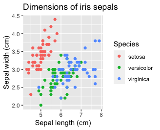

Welcome to the main page for Data Science Notes! These notes were used as the main reading material for the class DS 201: Introduction to Data Science at the University of Scranton. You'll find a variety of data science topics covered using the R programming language. The notes were written with the help of RStudio And RShiny.

The above image is used in classifying the famous iris dataset by plotting sepal lengths and widths as a scatterplot. Such a method works great for identifying setosas, but more advanced methods will be needed for successfully distinguishing between versicolors and virginicas (in particular, we'll use k-nearest neighbors on a higher dimensional dataset). In these notes, you will gain methods for visualizing data, and also some methods for making meaningful statements about data. This requires a basic understanding of statistics and probability, which is also covered, with a bent toward "proof by simulation".

Text and figures are licensed under Creative Commons Attribution CC BY-NC 4.0. The figures that have been reused from other sources don't fall under this license and can be recognized by a note in their caption: "Figure from ...".
