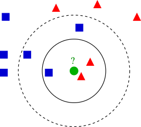

```{r setup, include=FALSE}
knitr::opts_chunk$set(echo = TRUE)
```


```{r include=FALSE}
library(ggplot2)
library(dplyr)
```

# Machine learning

The field of __machine learning__ began to take hold around the middle of the 20th century.  Like the field of computer science, mathematicians were at the forefront of laying the foundations which have eventually led to the many creature comforts we are experiencing today.  Every time you cash a check at an ATM or on a cell phone, for instance, a machine learning is at work, using loads of previous written digits as training data to guess what you _meant_ to write with astounding accuracy.  Almost every major business uses machine learning to direct you to finding the right person to speak to on the telephone (alright, alright, often that process is incredibly annoying, but apparently it cuts down on total time on the phone, or the business wouldn't be using it).  Phone apps use machine learning to identify songs after a few seconds.  There's even an app for identifying species by simply taking a snapshot in a garden!  Machine learning will be at the forefront of what types of jobs we will all be doing in the future.  

It won't all be roses, of course.  Plenty will be displaced, and it's a serious question of what we're going to do with truckers when self driving cars are prevalent.  Other professions that you might not expect may be on the chopping block too.  Machine learning algorithms are already beating doctors in identifying tumors, and there are plenty of opportunities for automation to replace soldiers (this too, is loaded with ethical dilemmas).  It's unfortunate that the reduction of labor, what of first blush seems to be an absolute good, might cause a good deal of hardship in the future.  Data scientists are obviously going to be needed in developing all of this automation, but we'll also need very bright people to figure out how to transition through this with as little turbulence as possible.  

Alright, enough of the doom and gloom.  Let's get into the meat of machine learning.  We're going to go over the bare bones of two basic methods in machine learning,  __k-means__ and __k-nearest neighbors__.    

# $k$-nearest neighbors

 The algorithm of  $k$-nearest neighbors (Knn) is a type of __clustering algorithm__.  The main question is as follows:  Given a element with certain features, predict a labeling. Knn, unlike logistic regression, is __nonparametric__. The $k$ in $k$-nearest neighbors gives a __tuning parameter__.  This is something we start off with--in parametrized models we _learn_
the parameter through training. 


The idea is that given a point, we predict its label by guessing the labels
of nearby datapoints in the training set.  We can visualize a decision boundary
in two dimension, but it is still possible to preform this in high dimensions.


A few points before we dig in:

1) The distance between two datapoints has a great deal of wiggle room. 
We can define a distance using any __metric__ $d(x,y)\ge 0$ satisfying
\begin{enumerate}
\item $d(x,y) = 0 \Longleftrightarrow  x = y$,
\item $d(x,y) = d(y,x),$
\item $d(x,y) \le d(x,z) + d(z,y).$
\end{enumerate}

Examples abound.  For two vectors, the most common metric is the __Euclidean
metric__
\begin{equation}
d(\mathbf x, \mathbf y) = \sqrt{(x_1-y_1)^2+(x_2-y_2)^2+\dots+(x_n-y_n)^2}.
\end{equation}

<center>



</center>
> __Q:__ Under different $k$, how ought we label the unclassified green circle?

# Knn on the iris dataset


We'll need the <TT>class</TT> package for running knn.

```{r}
library(class)
```


```{r}

# Some minor changes in the data set

# Normalizing variables

#Question: what does the -5 mean?
dataNorm = iris
dataNorm[,-5] = scale(iris[,-5])


#To make sure we can get repeatable (reproducible) results

set.seed(1234)


#This is picking (approximately) 70% of data to be training data.  
#What should you do if you always want fraction to be the same?
ind = sample(2, nrow(dataNorm), replace = TRUE, prob = c(.7, .3))

trainData = dataNorm[ind == 1, ]

testData = dataNorm[ind == 2, ]


#knn with k = 3
Knntestpredict = knn(trainData[,-5], testData[,-5],
                        trainData$Species, k = 3, prob = TRUE)

Knntestpredict


```

Here is the __confusion matrix__

```{r}
table(testData$Species, Knntestpredict)


```


The rows represent the actual species of plant, and the columns represent the estimates from knn.  The more entries on the diagonal, the better.  In our case, for $k = 3$, we have correctly classified $10+12+14 = 36$ plants.  Two virginicas, however, have been misclassified as versicolor.  


> __Q:__ For different values of $k$, how does our confusion matrix perform.  Is it true that the higher the $k$, the better?  What happens when $k$ becomes very large?


# K-means

 The history of k-means is quite old:\ it
goes at least as far back as the Polish mathematician  Hugo Steinhaus in
the 1950's. The point of $k$-means is to do clustering without training.  This means
that our data is not labeled.  It is simply a collection of points in some
space. After initializing with $k$ centroids, the two steps to k-means are 

1. (Labeling) Compute a __Voronoi diagram__ for centroids $x_1, \dots,
x_k$.  This produces cells which partition $C_1, \dots, C_k$ the plane and
have the minimum distance property
\begin{equation}
x\in C_k \Rightarrow d(x,x_k) \le d(x,x_i), \quad i \neq k.
\end{equation}


2. (Update) Reposition centroids to the average position of points in
the Voronoi cells.
\begin{equation}
\frac{1}{|C_k|}\sum_{x \in C_k} x\leftarrow x_k .
\end{equation}


The goal is to try clustering points which are close to each other.  For
a measure, we want to minimize

\begin{equation}
\sum_{i = 1}^k \sum_{x \in x_k} d(x,x_k).
\end{equation}


This minimization ensures that points in a cluster to be close to eachother,
but points from two different clusters to be far apart as possible. K-means
will converge to some local minimum of (3), but this may not be the global
minimum.  

## A clear example in two-d


Let's generate some points in which it should be clear how k-means will work

```{r}

pts <- rbind(matrix(rnorm(100, sd = 0.3), ncol = 2),
           matrix(rnorm(100, mean = 1, sd = 0.3), ncol = 2))
colnames(pts) <- c("x", "y")

X = data.frame(pts)

#testing for 8 clusters
cl <- kmeans(pts, 2)

X$cluster = as.character(cl$cluster)

X %>% ggplot(aes(x,y, color = cluster)) + geom_point()


```


> __Q:__ Obviously, $k = 8$ isn't the right $k$.  What is the correct $k$?  


## Iris dataset and k-means

What happens if we try classifying the iris dataset by k-means?  This is a bit odd, since we are not using the labels at all!  

```{r}

clust = kmeans(scale(iris[-5]), 3)

clust$cluster

Z = data.frame(clust$cluster, iris$Species)

#Let's tally what each cluster gets

tally = matrix(0,3,3)

for (i in 1:dim(Z)[1]){
  q = Z[i,1]
  tally[q,1] = tally[q,1]+ (Z[i,2] == 'setosa')
  tally[q,2] = tally[q,2] + (Z[i,2] == 'versicolor')
  tally[q,3] = tally[q,3] +(Z[i,2] == 'virginica')
  
}


print(tally)


```


